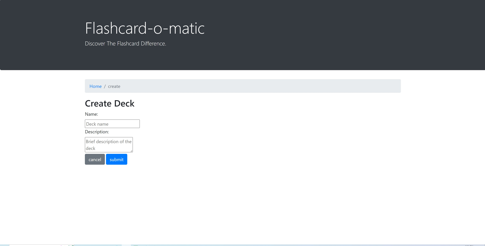

# flash-card-with-react
1. First do npm install
2. npm start to start the React app
## more info about the project ##
This project follows the CRUD pattern. Users can create, read, update, delete decks that contain cards.
Users can also create, read, update, delete the cars inside the decks. They can even flip the cards to see the front information and the information from the back.
 ### Images ###

